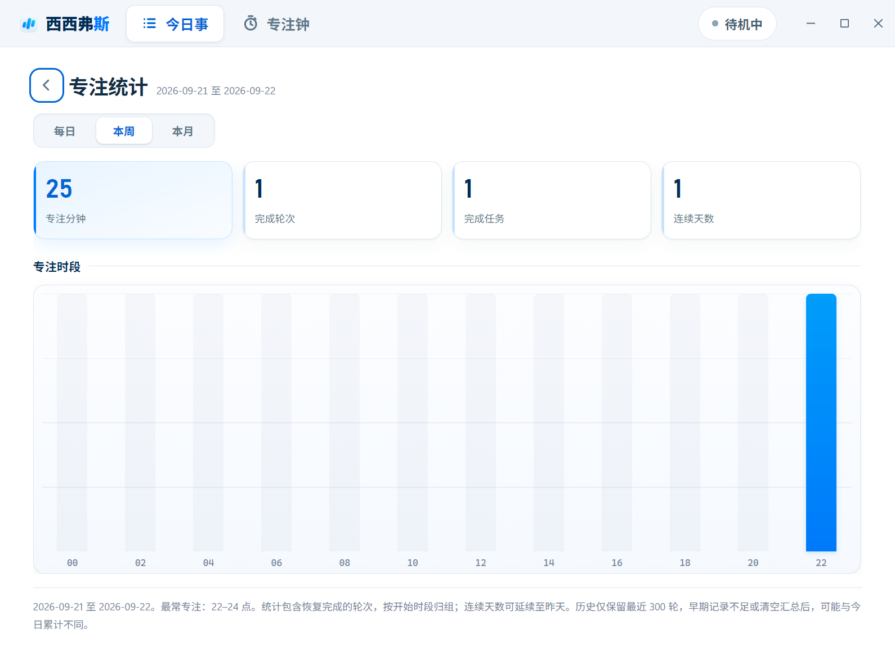

# 西西弗斯 · 专注工作台


[English](README.en.md) · 中文

两个专注小工具，打包成一个 **Electron 无边框桌面应用**：

- **今日事** —— 任务管理（每日任务模板、月历、按日期分组、子步骤、任务闹钟，未完成自动顺延）
- **专注钟** —— 纵向「字符海」倒计时（水面随进度下降），多轮番茄计划自动推进，可弹成桌角常驻小窗
- **每日时间轴** —— 这一天哪些时间段做了哪些事；自定义 MD 模板一键导出笔记（Obsidian / Notion 联动）

没有系统标题栏：拖拽区、导航、最小化/最大化/关闭都在应用自己的标题栏里；计时状态在主窗标题栏实时可见，并可常驻**系统托盘**。

**完全本地**：不发一个网络请求、没有账号、没有遥测。所有数据就是你磁盘上的一个 JSON 文件。

## 界面预览

| 今日事 | 专注钟 | 专注统计 |
|---|---|---|
|  |  |  |

---

## 下载与安装（无需命令行）

从本仓库 **Releases** 页面下载 Windows x64 产物，双击即可：

| 文件 | 说明 |
|------|------|
| `Sisyphus-2.0.0-setup.exe` | 安装版：装到 `%LOCALAPPDATA%\Programs`，创建桌面与开始菜单快捷方式（名称「西西弗斯」），**卸载保留用户数据** |
| `Sisyphus-2.0.0-portable.exe` | 免安装版：双击直接运行，数据同样在 `%APPDATA%\Sisyphus` |

> **产物未做代码签名**（本项目没有购买代码签名证书），首次运行 SmartScreen 可能提示「未知发布者」，
> 点「更多信息 → 仍要运行」即可。校验完整性请对照 Release 里的 `SHA256SUMS.txt`。
> 仓库里**没有 .cmd 启动脚本**：日常使用就是双击上面的 exe；要从源码跑才用 `npm start`（见下文）。
>
> 签名管线已经接好（`CSC_LINK` / Azure Trusted Signing / `npm run verify:signature`），
> 拿到证书后构建产物即可带上可信签名，详见 [docs/release.md](docs/release.md#代码签名)。

---

## 为什么它和别的番茄钟不一样

| 常见做法 | 这里的做法 |
|---|---|
| 计时状态跟着页面走：刷新、关窗、换页面就断 | **唯一权威计时状态机住在主进程**（`src/main/timer.js`）。窗口只是只读显示端，关小窗、刷新主窗、重开应用都不影响计时 |
| 数据散在 localStorage / 各窗口各写各的 | **主进程唯一写者**（`src/main/store.js`）：原子写（`.tmp` + rename）、启动滚动备份、导入前必先备份、磁盘验证失败自动回滚 |
| 「本轮算不算数」说不清 | 显式状态机 + 完成事件/统计/历史**各只发生一次**（重入保护），跨午夜按**完成那一刻**的日期归属 |
| 鼠标离开就不知道自己在干嘛 | 字符海 + 标题栏状态条 + 托盘提示三处同步显示同一份状态，暂停时动画**完全静止** |
| 悄悄联网、统计上传 | 零网络：页面 CSP `default-src 'none'`、`connect-src 'none'`，无遥测、无更新检查、无崩溃上报 |

## 架构

旧版的问题是：主窗内嵌的专注钟与独立小窗是**两个计时实例**，共用同一批 localStorage 键却各自维护内存状态 —— 同时打开会互相覆盖、统计重复累加、暂停不同步。

现在的三条主线：

| 问题 | 现在的做法 |
|------|-----------|
| 双实例计时冲突 | 计时状态只有一份，住在主进程（`src/main/timer.js`）；两个窗口只能发命令、订阅广播 |
| 数据可靠性 | 主进程唯一写者（`src/main/store.js`）→ `%APPDATA%\Sisyphus\sisy-store.json`，原子写 + 滚动备份 + 导入导出 |
| 单文件堆逻辑 | 拆成 `shared/` + `main/` + `todo/` + `timer/` 模块，页面 HTML 只留结构与样式 |

```
小程序/
├── index.html                  # 主窗外壳：自绘标题栏 + 今日事 iframe + 实时计时状态条
├── main.js                     # 进程装配：窗口 / 生命周期 / 电源事件 / 单实例锁
├── preload.js                  # 按用途分组的桥：dshWindow dshStore dshTimer dshData dshLog dshApp
├── smoke.js                    # 冒烟入口（必须以项目根作为 app path 启动）
├── package.json                # Electron 33.4.11 锁定；零运行时依赖（dependencies 为空）
├── assets/                     # 应用图标 + 标题栏 logo
├── electron/                   # 解压版 Electron 运行时（不入库，npm start 优先复用它）
├── src/
│   ├── main/
│   │   ├── store.js            # 权威存储（原子写 / 备份 / 导入验证 / 损坏恢复 / 分区清空）
│   │   ├── schema.js           # 已知存储键的结构校验 + 导入摘要 + 分区映射
│   │   ├── migrations.js       # 版本化迁移链（幂等，留迁移日志）
│   │   ├── timer.js            # 唯一计时状态机（显式转换 / 暂停 / 统计 / 抗改表 / 多轮计划推进）
│   │   ├── alarm.js            # 任务闹钟调度器（15 秒扫描，到点系统通知，当天同刻只响一次）
│   │   ├── tray.js             # 系统托盘
│   │   ├── ipc.js              # IPC 注册 + 对话框 + 日志文件
│   │   └── util.js             # 日期与时间格式化
│   ├── shared/
│   │   ├── log.js              # 统一日志（替代空 catch，转发到 userData/logs）
│   │   ├── date.js             # 日期键（零填充 YYYY-MM-DD）
│   │   ├── storage.js          # 渲染端存储适配（只走主进程）
│   │   ├── toast.js            # 提示条（保存失败等）
│   │   ├── dialog.js           # 轻量对话框（焦点陷阱 / Esc 关闭）
│   │   ├── icons.js            # sisy-icon 本地手写图标
│   │   ├── statistics.js       # 日历周/月统计汇总 + 每日时间轴推导（纯函数，可单测）
│   │   └── template.js         # 笔记模板引擎（单值/循环块替换，主进程与渲染端共用）
│   ├── todo/                   # 今日事：state.js 数据层 / render.js 渲染 / app.js 交互
│   └── timer/                  # 专注钟：flow.js 字符海 / ui.js 界面 / audio.js 铃声 / state.js 只读镜像
├── tools/
│   ├── check-syntax.js         # 语法 + 脚本引用 + id 存在性（含工具脚本）+ 加载顺序
│   ├── check-links.js          # 文档内部链接与锚点自检
│   ├── selftest.js             # 纯 Node 逻辑自检（119 项断言）
│   ├── smoke-test.js           # 真机冒烟（真开两个窗口验证一致性）
│   ├── ui-review.cjs           # 真实 Electron UI 验收（31 项检查 + 截图）
│   └── check-asar-runtime.js   # 校验新文件有没有被打进 asar
├── tests/                      # 回归套件（9 套，共 436 项断言）
├── docs/                       # 数据与恢复 / 发布打包 / 故障诊断 / 仓库配置
└── build/                      # Windows 一键构建 + 签名核验脚本
```

---

## 从源码启动（开发）

> 只是想**用这个应用**的话不用看这里 —— 双击 Release 里的 exe 即可。

```powershell
npm install        # 首次：拉取 Electron 运行时
npm start          # 启动主窗（今日事）
npm run compact    # 直接启动专注钟小窗
```

- 启动器 `tools/launch.js` 优先使用仓库内 `electron/` 解压版运行时（有就免下载），否则回退 `node_modules`。
- 打包成 exe：`powershell -File build\win-build.ps1`，产物在 `release\`（详见 [docs/release.md](docs/release.md)）。

### 验证命令

| 命令 | 作用 | 本机实测 |
|------|------|----------|
| `npm run check` | 静态检查：语法 / 脚本引用 / id 存在性（含 `tools/*.cjs` 里引用的元素）/ 加载顺序 | 43 个 JS·CJS 文件、3 个页面、61 处工具脚本 id 引用全部通过 |
| `npm run check:links` | 文档检查：Markdown 里的相对路径与 `#锚点` 是否真的存在 | 12 个文件 / 62 条链接全部有效 |
| `npm test` | 纯 Node 逻辑自检：日期、存储、计时状态机、任务数据层 | 119 项通过 |
| `npm run test:regression` | 回归套件 | 9 套 / 436 项断言 |
| `npm run verify` | 上面几项串起来（**提交前的总闸门，CI 用的就是它**） | — |
| `npm run smoke` | 真机冒烟：真开两个窗口验证同一份计时状态 | 29 项检查通过，结果写 `tools/smoke-result.json` |
| `electron tools/ui-review.cjs after` | 真实 Electron UI 验收：截图 + 布局断言 | 34/34 项通过，产物在 `.tmp/ui-review-out/after/` |
| `npm run verify:signature` | 核验 `release/` 里产物签名状态 | 见 [docs/release.md](docs/release.md#代码签名) |

> `tests/packaging-parity.test.js` 需要**已安装依赖**的环境（会调用 asar 检查打包一致性）；
> 没装依赖时它会报错，其余 7 套共 381 项断言不依赖任何第三方包。

---

## 专注钟

### 一个计时状态，两个显示端

```
main.js
  └── src/main/timer.js  ← 唯一状态（内存 + %APPDATA%\Sisyphus\sisy-store.json）
        ├── 主窗标题栏状态条          只读订阅
        └── 专注钟小窗（可置顶）       只读订阅
```

- 渲染进程只能 `dshTimer.cmd(type, payload)` 发命令，主进程算好再广播
- 小窗关闭、主窗刷新、重开窗口都不影响计时
- 统计只在主进程累加一次：**两个窗口同时开着也只记一轮**

### 界面

状态徽章（`待机中 / 专注中 / 已暂停 / 恢复中 / 短休息 / 长休息`，进行中会带上**本轮设定时长**，如 `专注中 · 45:00` 恒定不变；剩余倒计时看中央大数字）、大号剩余时间、计划/时长按钮（显示当前计划名或分钟数）、开始/暂停/重置；专注钟界面不再显示任务名（绑定关系保留，完成分钟照常记回任务）；设置面板里可开提示音、系统通知、动画档位、高对比度、显示秒、托盘常驻。**暂停时字符海完全静止**（连 rAF 都停掉），不会让人误以为还在跑。

### 单段专注与多轮计划

**单段**：`专注 25 / 短休 5 / 长休 15`，快捷预设 25/45 或自定义 1–180 分钟。休息结束只提示，不自动开始下一轮。

**多轮计划**（番茄法）：四套预设展开成段落队列后**自动推进**（专注 → 短休 → … → 专注 → 长休），全程无需干预：

| 计划 | 结构 | 段数 |
|------|------|------|
| 标准番茄 | 25 专注 ×4，轮间 5 短休，收尾 15 长休 | 8 |
| 深专注 | 45 专注 ×2，轮间 5 短休，收尾 15 长休 | 4 |
| 短冲刺 | 15 专注 ×4，轮间 3 短休，收尾 10 长休 | 8 |
| 长跑 | 50 专注 ×2，轮间 10 短休，收尾 20 长休 | 4 |

计划内段落完成**不弹完成屏**（toast + 系统通知提示下一段），整套跑完才回到完成屏。中途放弃 / 重置 / 改时长 / 切阶段 / 换计划即终止计划（进行中的轮次先记一条 abandoned 历史）；关窗期间到点走静默补记，补记后计划终止。

### 完成流程

（单段模式或整套计划跑完时弹出；计划内中途段落不弹）

- **再来一轮** / **休息 5 分钟** / **返回专注钟**
- 展开「查看本轮记录」：本轮计划时长 / 实际用时 / 是否暂停过（次数 + 总暂停时间）/ 开始与结束时刻

### 中断记录

每段结束（完成或放弃；计划内休息段也各记一条）追加到 `sisy-timer-history`（最多 300 条）：`日期 / 阶段 / 开始时间 / 结束时间 / 计划分钟 / 实际分钟 / 暂停次数 / 暂停分钟 / 结果`。今日事里的「专注统计」按**日历周 / 日历月**汇总分钟数、轮数、任务数、连续天数与一天中的高峰时段（含恢复完成的轮次，按开始时段归组）。

### 抗时间异常

- 计时命令走**显式状态机**：`idle / running / paused` 之外的转换被拒绝并记录（例如空闲时按暂停）
- 运行中剩余时间用**单调时钟**（`process.uptime()`）推算，系统改表不影响；检测到跳变会记录并在界面提示
- 单调时钟异常时自动退回墙上时钟
- 跨午夜继续跑，统计记在**完成那一刻**所在日期
- 休眠/唤醒、锁屏解锁都会立刻重算
- 关窗期间到点 → 重启后**静默补记**（不响铃、不通知；多轮计划在补记后终止，不自动推进）
- 完成事件 / 统计累加 / 历史写入各**只发生一次**（回归见 `tests/timer-correctness.test.js`）
- 运行中改时长 / 切阶段 / 换计划 / 重置：进行中的轮次自动补记一条 abandoned 历史，不再「无痕丢轮」

### 动画与可读性

- **目标 120 FPS**：用累加器保持平均帧率（165Hz 屏也不会被量化成 82 FPS）
- **字符精灵缓存**：`符号 × 颜色` 预渲染成离屏小画布，每帧 `drawImage` 代替 `fillText`
- **自适应密度**：按窗口面积决定格边长与最大格数，小窗自动降密度
- **自动降级**：连续偏慢时自动减密度并记日志（不卡死）
- 动画可设 `流畅 / 舒缓 / 关闭`；**关闭时完全停掉 rAF**，只在状态或尺寸变化时画一帧
- 数字区有稳定底衬 + 可开**高对比度模式**
- 系统 `prefers-reduced-motion` 会被尊重

### 托盘常驻

- 托盘提示实时显示 `专注中 12:34` / `已暂停 …` / `待开始`
- 菜单：开始/暂停、重置本轮、切换阶段、打开小窗、显示主窗、退出
- 主窗 ✕ 默认**留在托盘继续计时**（可在设置里关掉），首次触发会弹一次系统通知说明

---

## 今日事

- 任务按日期分组，月历导航，子步骤（小步骤清单）
- **未完成自动顺延**：普通任务（非每日任务）没做完，跨天自动搬进今天的列表并标「顺延」徽标（显示来源日），顺延任务置顶，直到完成或删除；每日任务每天自动重新出现，不参与顺延
- 子步骤全部完成 → 主任务自动完成；取消任一子步骤 → 主任务回退
- **任务闹钟**：任务行可设 `HH:MM` 提醒，到点主进程发系统通知（15 秒扫描，误差 ≤15 秒）；已完成的任务不提醒，同一任务同一时刻当天只响一次
- 状态汇总（⏱ 专注分钟、步骤进度、闹钟时刻）收在标题行右侧的小胶囊里，不占任务本体空间
- **每日任务**：在 ⚙ 设置里配置，每天首次进入自动「实体化」成当天列表里的普通任务；**当天删除后不再补回**（记 `dismissedDaily`），跨天自动生成新一天
- 过去的日期也能编辑：可勾选完成、改标题、增删改小步骤；「新增任务 / 拖拽排序 / 点开专注」仍限今天
- 每个任务可一键**开始专注**：先绑定任务并打开专注钟的计划选择器，选定计划/时长点「开始」才开跑；已完成绑定的本轮任务再点则直接**继续本轮专注**；完成后把分钟数记回该任务

## 每日时间轴（任务时段记录）

专注统计里的「每日」视图，回答「这一天哪些时间段做了哪些事」：

- 时段从 `sisy-timer-history` **纯推导**（不增加记录负担）：同任务相邻专注段（间隔 ≤15 分钟，含计划内休息）合并为一个连续时段（如 `08:00–10:20 写报告`），中断（abandoned）独立标注，未绑定任务的专注显示为「未定任务的专注」
- 纵向时间轴按分钟定位，**重叠时段并排分列**（允许重叠），支持前后日导航
- **时间轴可自定义**：每块可改起止时间、隐藏误记块，也可手动补录时段；修正存入覆盖层 `sisy-timeline-overrides`——只修正显示，权威历史与派生数据不动，重算后修正不丢

## 笔记模板导出（Obsidian / Notion 联动）

不接 API、零网络的最小联动：**可编辑的 MD 模板 + 标准命名变量**，渲染后复制到剪贴板（粘贴进 Notion / Obsidian）或存为 `.md` 文件（直接落 Obsidian vault）。

- 内置三份初始模板：**每日复盘 / 单任务记录 / 周报**；「⚙ 设置 → 笔记模板」可编辑、即时预览、恢复默认
- 变量（snake_case）：`{{date}}` `{{date_cn}}` `{{weekday}}` `{{focus_minutes}}` `{{focus_rounds}}` `{{tasks_done_count}}` `{{task_title}}` `{{task_minutes}}` `{{week_since}}` `{{week_until}}` `{{streak}}` `{{peak_range}}` 等；循环块 `{{#timeline}}…{{/timeline}}`、`{{#tasks_done}}…{{/tasks_done}}`（块内 `{{start}}` `{{end}}` `{{title}}` `{{minutes}}`；支持 `{{^list}}` 空态）；未知变量原样保留
- 入口：每日时间轴工具栏（复制今日复盘 / 存为 .md / 复制周报）、时间轴块上的「任务记录」（单任务模板）
- 模板存 `sisy-export-template`（每份 ≤32KB，损坏回落默认），随整库备份/导入自动跟随
- 日期键统一为零填充 `2026-09-08`，旧的 `2026-9-8` 会在加载时自动迁移（同键合并）
- 损坏数据会被识别、另存为 `<键名>__corrupt_<时间>` 并重置，同时写日志

## 数据

**全部数据在主进程**，文件是 `%APPDATA%\Sisyphus\sisy-store.json`（`userData` 按 productName 命名；路径可在「今日事 → ⚙ 设置 → 数据备份」里看到）：

| 键 | 内容 |
|----|------|
| `sisy-focus-state-v2` | 今日事任务（按日期；含每日任务实体化 + `dismissedDaily` + 任务闹钟 `alarm` + 顺延来源 `rolledFrom`） |
| `sisy-daily-config` | 每日任务模板 |
| `sisy-timer-state` | 专注钟当前状态（阶段 / 剩余 / 暂停统计 / 多轮计划 `plan`） |
| `sisy-timer-stats` | 今日专注统计（轮数、分钟数） |
| `sisy-timer-run` | 兼容旧版读取的运行态镜像 |
| `sisy-timer-prefs` | 声音 / 通知 / 动画 / 高对比 / 托盘等设置 |
| `sisy-timer-history` | 完成与中断记录（最多 300 条） |
| `sisy-timeline-overrides` | 时间轴修正层（改起止 / 隐藏 / 手动补录块） |
| `sisy-export-template` | 笔记模板（每日复盘 / 单任务 / 周报） |

- 结构校验（`src/main/schema.js`）+ 版本化迁移（`src/main/migrations.js`）；导入走「解析→校验→摘要→**只备份一次**→写入→磁盘验证→刷新」，失败自动回滚，坏数据进不了库
- 每次启动生成一份 `backups/sisy-store-YYYYMMDD.json`，最多保留 10 份；主文件损坏时自动尝试 `.tmp` / 最近备份恢复，损坏现场永久保留（恢复手册见 [docs/data.md](docs/data.md) / [docs/diagnostics.md](docs/diagnostics.md)）
- 「数据备份」里可以：**导出 JSON / 从备份导入 / 打开备份文件夹 / 打开日志 / 清空全部数据**
- 导入时可选**合并**或**整体替换**；清空同样先备份；底层支持**分区清空**（tasks / daily / stats / history / prefs / timerState，各分区影响面见 [docs/data.md](docs/data.md)）
- 保存失败会弹提示「数据保存失败，请导出备份」，不会静默丢数据

## 安全与隐私

- **零网络**：三个页面都有 CSP（`default-src 'none'` / `connect-src 'none'`），代码里没有任何 `fetch` / `XMLHttpRequest` / 第三方脚本，也没有更新检查与遥测
- **IPC 参数全量校验**：存储键名、时长、阶段、偏好、导入模式、文件路径白名单（`reveal` 只允许应用数据目录内，导出文件单独授权）
- 渲染进程关闭 `nodeIntegration`，只通过 `preload.js` 暴露分组的、白名单化的 API
- `sandbox:false` + `nodeIntegrationInSubFrames:true` 是**刻意**的（本地文件页面 + 子帧需要 preload 桥），成因与威胁模型写在 [SECURITY.md](SECURITY.md)
- 日志不落任务正文；漏洞上报流程见 [SECURITY.md](SECURITY.md)

## 开发

改完在应用里 `Ctrl+R` 刷新即生效（主进程代码需重启应用）。

| 位置 | 说明 |
|------|------|
| `src/timer/flow.js` → `draw()` | 字符海渲染：`RAMP` 符号阶、`COLORS` 配色、`cell` 自适应、精灵缓存 |
| `src/timer/ui.js` → `render()` | 状态徽章 / 时间 / 按钮 / 设置面板 / 完成屏 |
| `src/main/timer.js` | 计时状态机：命令、完成、多轮计划推进、统计、抗时间异常 |
| `src/main/alarm.js` | 任务闹钟调度器 |
| `src/main/store.js` | 存储：原子写、备份、导入导出、损坏恢复 |
| `src/todo/state.js` / `render.js` | 任务数据层 / 渲染层 |

改完请跑 `npm run verify`；桌面交互相关改动再补一次 `electron tools/ui-review.cjs after`。
提交规范、分支命名与「为什么没有 ESLint」的口径见 [CONTRIBUTING.md](CONTRIBUTING.md)。

## 文档

| 文档 | 内容 |
|------|------|
| [docs/data.md](docs/data.md) | 数据文件清单、迁移链、导入流程、备份与损坏恢复、分区清空影响面 |
| [docs/release.md](docs/release.md) | 打包方式、代码签名（两条路线）、CI、安装/升级/卸载数据行为 |
| [docs/diagnostics.md](docs/diagnostics.md) | 故障诊断手册（日志线索 → 含义 → 处置） |
| [docs/github-setup.md](docs/github-setup.md) | 把仓库正式发布到 GitHub 的清单（描述、topics、分支保护、占位符替换） |
| [ROADMAP.md](ROADMAP.md) | 后续计划与「明确不做」的边界 |
| [CONTRIBUTING.md](CONTRIBUTING.md) | 贡献流程与验证门槛 |
| [SECURITY.md](SECURITY.md) | 威胁模型、安全边界、漏洞上报 |
| [CHANGELOG.md](CHANGELOG.md) | 版本变更记录（含 1.x 历史） |

## 已知限制

- **仅 Windows 10/11 x64**：白窗口自绘标题栏、托盘、电源事件都针对 Windows 调过；其他平台未验证
- **产物默认未签名**（项目没有代码签名证书）→ SmartScreen 会提示「未知发布者」；签名管线已就绪；免费路线（Microsoft Store 重签 / SignPath Foundation）与付费路线、资格限制见 [docs/release.md](docs/release.md#代码签名)
- 本机未开 Windows 开发者模式时，winCodeSign 解压软链会失败 → 构建脚本自动降级 `signAndEditExecutable=false`（exe 内嵌图标/元数据用 Electron 默认值，产物仍可运行；CI 上走完整路径）
- 托盘**不做**「空闲时阻止系统睡眠」：合盖、手动睡眠仍会中断专注（挂起期间的完成会在唤醒后补记）
- 任务闹钟只在应用运行期间生效（托盘常驻时关窗也响）：应用未运行时不响，睡眠/关机错过的时点不补
- 中断记录已落盘并可视化汇总，但还没有「我经常在什么时候中断」的细粒度分析
- 2.0.0 是**破坏性**版本：技术命名统一为 `sisy-*`，**不提供 1.x 数据自动迁移**，手工迁移步骤见 [docs/data.md](docs/data.md#7-从-1x-手工迁移)

## 开源协议

[MIT](LICENSE) © 2026 GenZ。可自由使用、修改、分发，保留版权声明即可。

欢迎提 Issue / PR，也欢迎直接 Fork 改成你自己的节奏工具。
